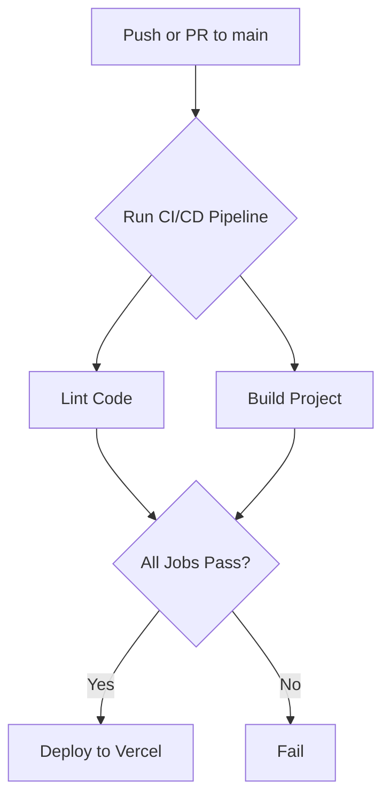

# Plan: Implement CI/CD and Synchronize Documentation

This document outlines the plan to implement a CI/CD pipeline for the Nunflix project and synchronize all project documentation.

## 1. Implement the CI/CD Pipeline

A GitHub Actions workflow will be created to automate the testing and deployment process.

*   **File Location:** `.github/workflows/ci.yml`
*   **Triggers:** The workflow will be triggered on any push or pull request to the `main` branch.
*   **Jobs:**
    *   **Lint:** Run `eslint` to enforce code quality standards.
    *   **Build:** Execute a production build of the Next.js application to ensure there are no compilation errors.
    *   **Deploy:** Automatically deploy the application to Vercel after a successful build on the `main` branch.

### Workflow Diagram

## 2. Synchronize All Project Documentation

After the CI/CD pipeline is implemented, all project documentation will be updated to reflect the current state of the project. This will ensure consistency and accuracy across all documents.

The following files will be updated:
*   `PROJECT_SUMMARY.md`
*   `PROGRESS_RECAP.md`
*   `RUNBOOK.md`
*   All files within the `memory-bank` directory.