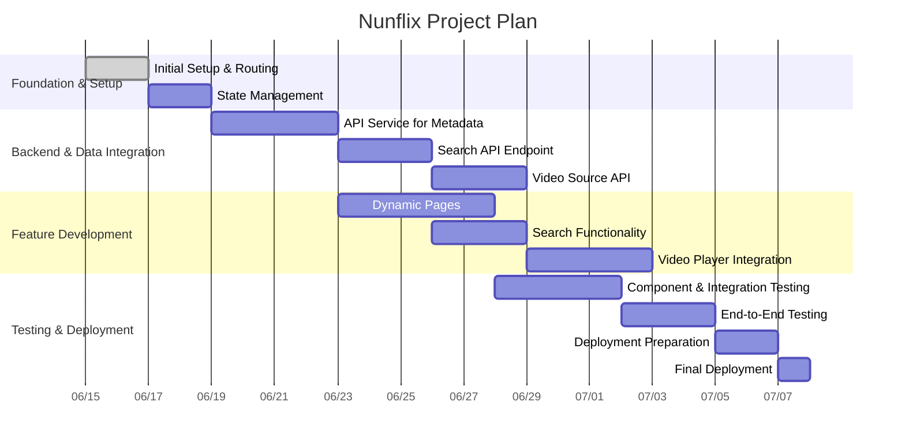

# Project Plan: Nunflix Clone

This document outlines the plan to build a fully functional clone of a streaming website, "Nunflix," as detailed in `Indeed.md`. The final product will be a production-ready website.

### Project Goal
To build a fully functional clone of a streaming website, "Nunflix," as detailed in `Indeed.md`. The final product should be production-ready.

### Technical Vision
The target architecture is a modern, decoupled system:
*   **Frontend:** A static-first Single Page Application (SPA) built with React.
*   **Backend:** A set of microservices to handle API requests for search, metadata, etc.
*   **Video Delivery:** An embedded video player that streams content (HLS) from external hosting providers.

### Current State
The project is currently a static React application. It has a well-structured set of presentational components and uses mock data to populate the UI. There is no routing, state management (beyond component-level), or API integration yet.

---

### Project Phases

---

### Phase 1: Foundation & Setup

*   **Goal:** Establish the core structure of the application.
*   **Tasks:**
    1.  **Implement Routing:** Set up a routing system (e.g., React Router) to handle navigation between different pages (Home, Movies, TV Shows, Search Results, Details Page).
    2.  **State Management:** Integrate a state management library (e.g., Redux Toolkit, Zustand) to manage global application state, such as user information, search queries, and API data.

### Phase 2: Backend & Data Integration

*   **Goal:** Replace mock data with live data from a backend API.
*   **Tasks:**
    1.  **Metadata API Service:** Develop or integrate with a service that provides movie and TV show metadata (as described in `Indeed.md`, this could scrape from TMDB, OMDb, etc.).
    2.  **Search API:** Create a dedicated API endpoint for handling search queries.
    3.  **Video Source API:** Build an API to fetch embeddable video source URLs based on the selected content.

### Phase 3: Core Feature Development

*   **Goal:** Build the primary user-facing features of the website.
*   **Tasks:**
    1.  **Dynamic Pages:** Create dynamic pages for individual movies and TV shows, populating them with data from the metadata API.
    2.  **Search Functionality:** Implement the search bar to query the search API and display results.
    3.  **Video Player Integration:** Integrate a video player (e.g., Plyr, JWPlayer) within an iframe to stream content using the URLs from the video source API.

### Phase 4: Testing & Deployment

*   **Goal:** Ensure the application is robust, bug-free, and ready for production.
*   **Tasks:**
    1.  **Unit & Integration Testing:** Write tests for individual components and their interactions.
    2.  **End-to-End (E2E) Testing:** Create automated tests that simulate user journeys through the application.
    3.  **Deployment Preparation:** Configure the application for deployment (e.g., environment variables, build scripts).
    4.  **Final Deployment:** Deploy the frontend to a static hosting provider (like Netlify or Vercel) and the backend services to a suitable platform.